# Enterprise RAG Copilot

**企业知识智能与售前 Agent 工作台**
*AI-powered Knowledge Intelligence & Pre-sales Copilot*

一个完整的企业级 AI 工作台：从企业知识资产治理，到可溯源的 RAG 问答，再到 Agent 化的售前方案生成与质量评估。
不是「上传文件 → 问问题」的 Demo，而是把 **Knowledge → Retrieval → Rerank → Grounded Generation → Agent/Skill/Tool → Trace → Evaluation** 整条链路真实打通、并且可以逐层验证的产品。

---

## 1. 项目概览

| | |
| --- | --- |
| **产品形态** | Next.js 15 前端 + FastAPI 后端 + LangGraph Agent 运行时 |
| **核心能力** | 混合检索问答（带引用）、Agent 工作台、售前方案生成、知识缺口分析、RAG 评测 |
| **检索链路** | BM25 关键词 + 向量语义 + RRF 融合 + 重排序（4 层，全部可观测） |
| **Agent 架构** | Agent（意图/计划/执行）→ Skill（7 项业务能力）→ Tool（10 个工具） |
| **执行引擎** | LangGraph 1.2 与内置状态机双引擎，共用同一套节点函数 |
| **可观测性** | 每个节点记录耗时/输入/输出；SQLite 活动台账；Dashboard 真实指标 |
| **评测** | Hit@K / MRR / Recall@K / 关键词覆盖（确定性计算）+ 人工答案评分 |
| **规模** | 后端约 50 个模块 · 161 个 pytest 用例 · 前端 10 个页面 |
| **实测指标** | 检索 Hit@4 = 90%，MRR = 0.800（10 条冻结评测集，真实知识库） |
| **验收状态** | ✅ **READY FOR DEMO** —— 见 [`docs/V3_ACCEPTANCE_REPORT.md`](docs/V3_ACCEPTANCE_REPORT.md) |

---

## 2. 为什么做这个项目

我在元气森林做 AI Agent + 商业分析实习时，真实的工作流是这样的：

> 客户或同事提出一个问题 → 我需要翻遍散落的政策文件、产品资料、案例文档 → 找到依据 → 写一段结论 → 还得能说清「这个结论是从哪份文件的哪一段来的」。

这套动作有三个痛点，**每一个都需要工程能力而不是提示词技巧来解决**：

1. **找不到** —— 关键词搜索匹配不到语义相近的表述，只能靠人记文件名。
2. **说不清** —— 答案没有引用，别人无法复核，自己也讲不清依据。
3. **补不齐** —— 反复答不上来的问题背后，是知识资产的系统性缺口，但没人统计。

所以我把它做成了一个真实的产品：**检索要能解释为什么排这个顺序，回答要能点回原文，缺口要能用规则算出来**。
把售前方案生成也纳入进来，是因为「写方案」本质上是同一件事的延伸——把知识库里的证据，组织成对客户可交付的结构。

这个项目同时也是我的毕业设计载体（Project Companion 路线中的 Memory / RAG / Tool Calling / Workflow 环节），因此每一层都刻意做成了可替换、可测试的模块，而不是一次性脚本。

---

## 3. 截图（V3，真实运行数据）

> 全部来自本机真实运行的 V3，1440×900，无 mock、无开发者工具、无密钥。
> 生成方式见 [`docs/V3_ACCEPTANCE_REPORT.md`](docs/V3_ACCEPTANCE_REPORT.md)。

**Overview — 四组真实指标（24 文档 / 283 知识块 / 16 次 Agent 运行 / 溯源率 100%）**

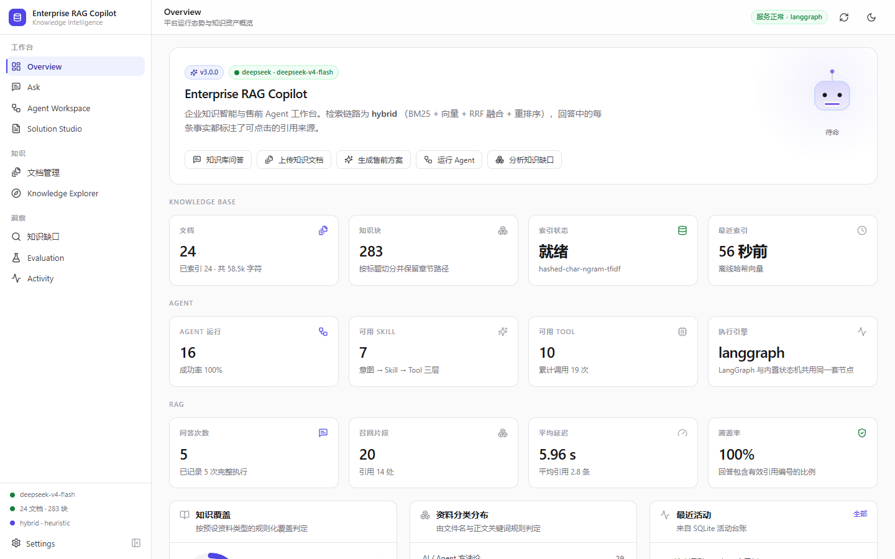

**Ask — 带引用编号的回答，编号可点击**

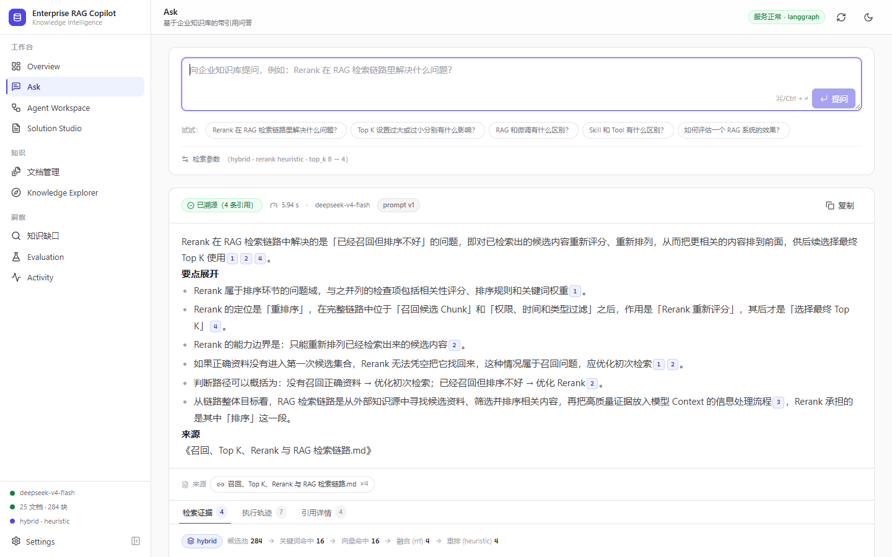

**Citation Drill-down — 点开 `[1]` 看到被引用的原文片段与四类检索分数**

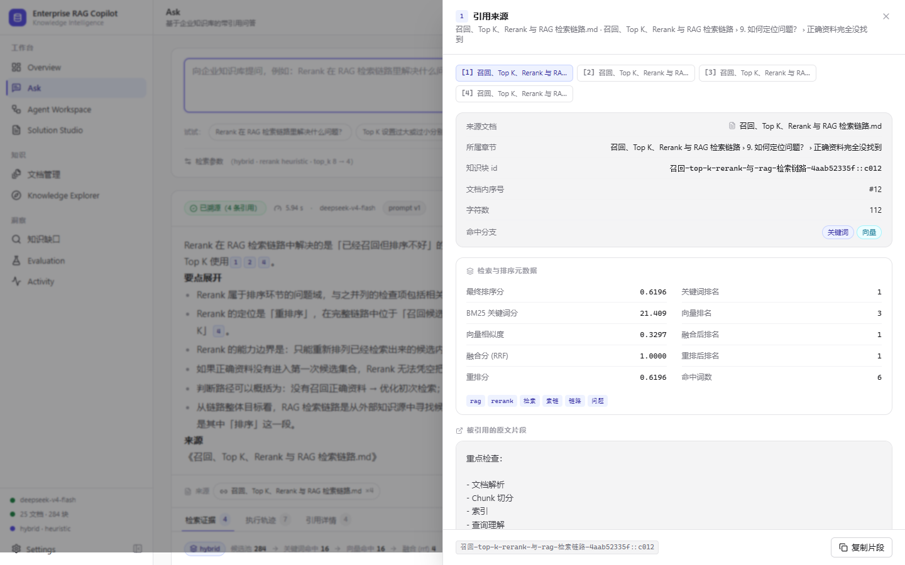

**Agent Workspace — 意图、置信度、Skill、Tool 调用与 8 节点轨迹**


| 展开的 Agent Trace | Solution Studio（8 章节 + 引用） |
| --- | --- |
| 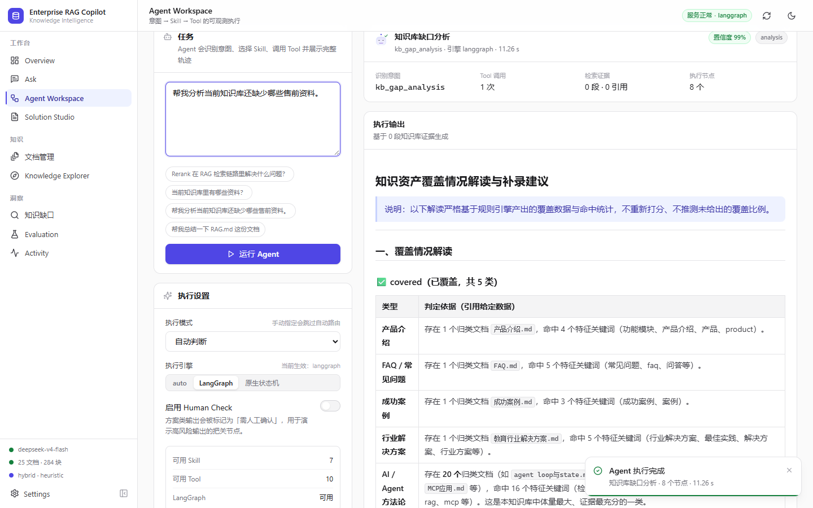 | 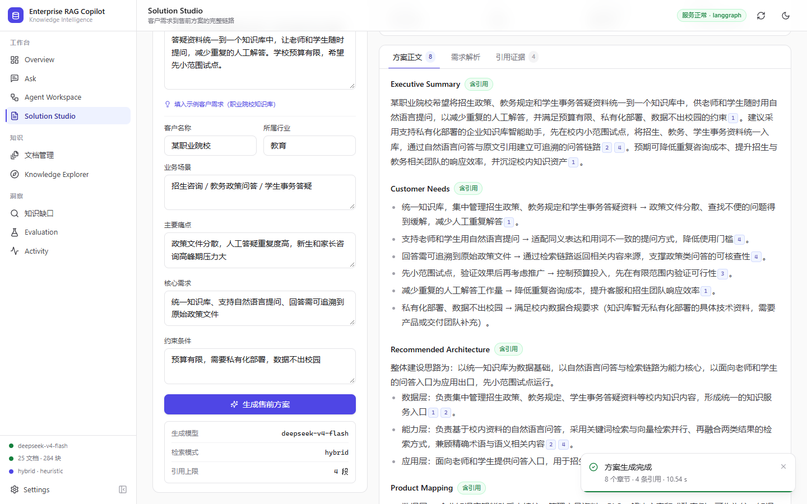 |

| Knowledge Explorer（含检索探测） | Knowledge Gaps（覆盖判定 + 证据） | Evaluation（检索指标） |
| --- | --- | --- |
| 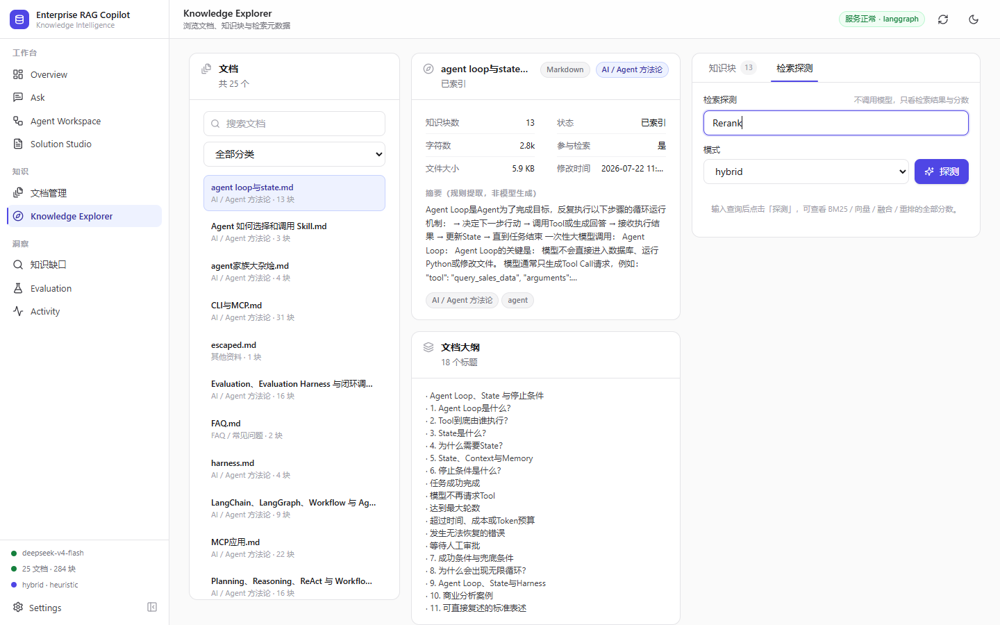 | 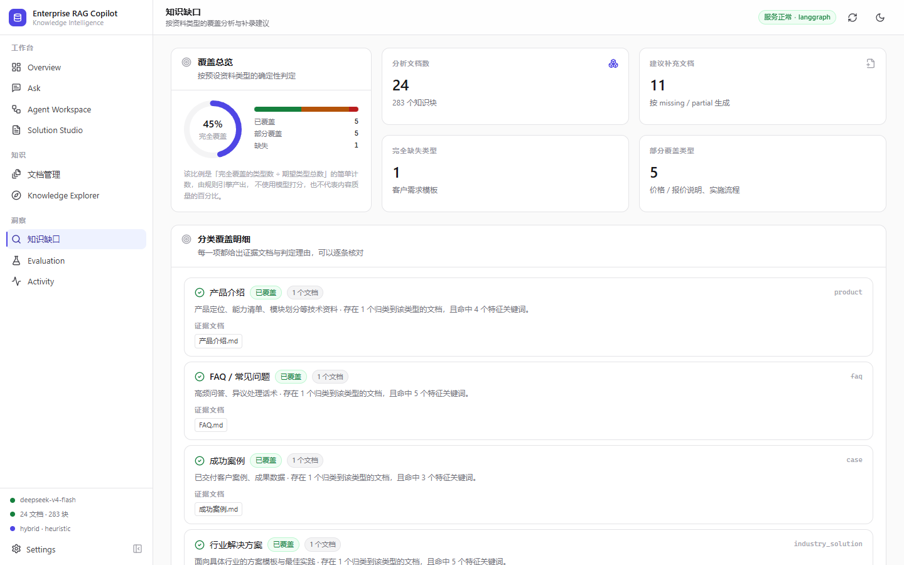 | 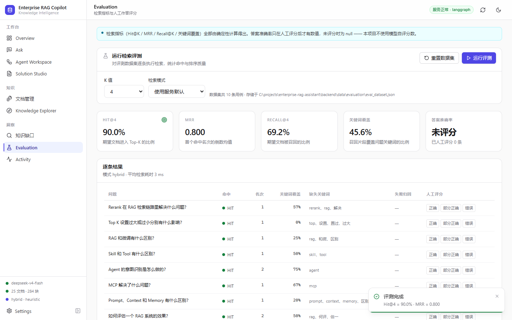 |

深色主题同样是一等公民（`dark-overview.png` / `dark-ask.png` / `dark-solution.png` 见同目录）。

<details>
<summary><b>Legacy — Streamlit V2（已冻结在 <code>legacy/</code>）</b></summary>

| 工作台总览 | RAG 问答结果 |
| --- | --- |
| 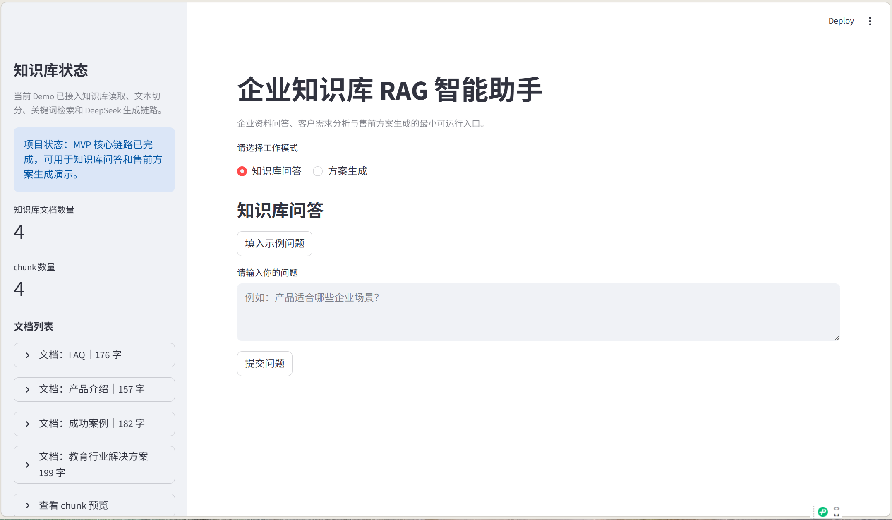 | 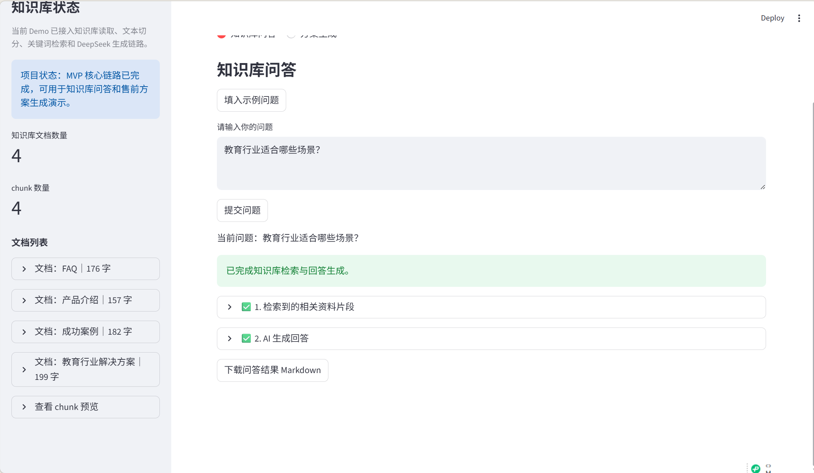 |

| 检索片段详情 | 方案生成工作流 |
| --- | --- |
| 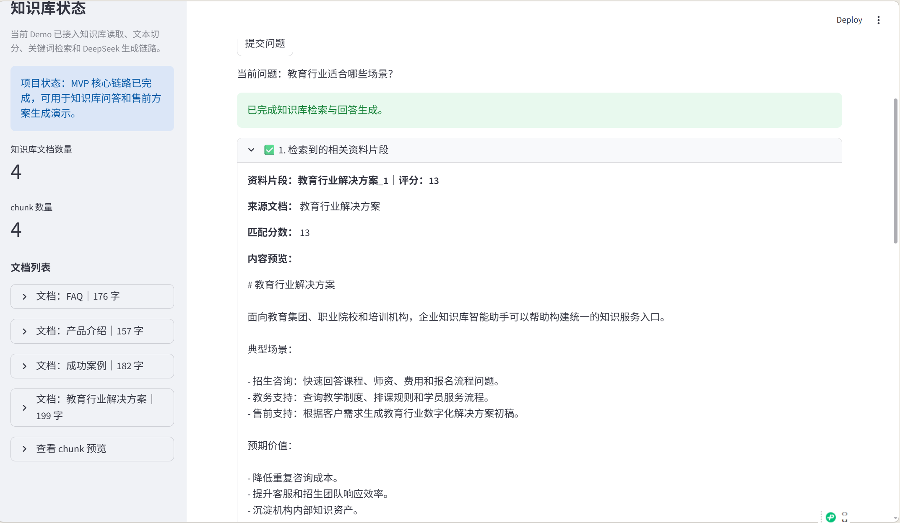 | 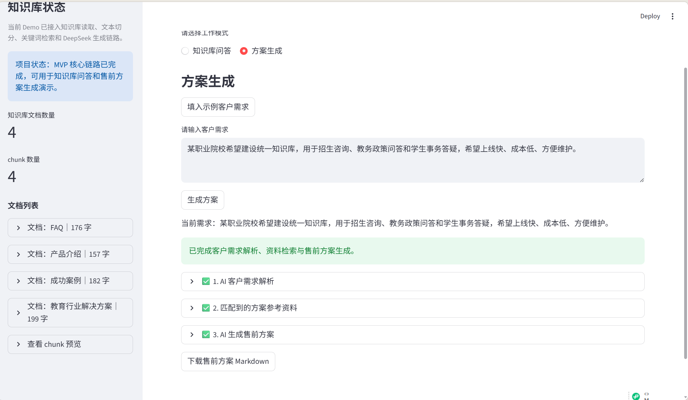 |

V2 仍可运行：`streamlit run legacy/app.py`。
</details>


---

## 4. 系统架构

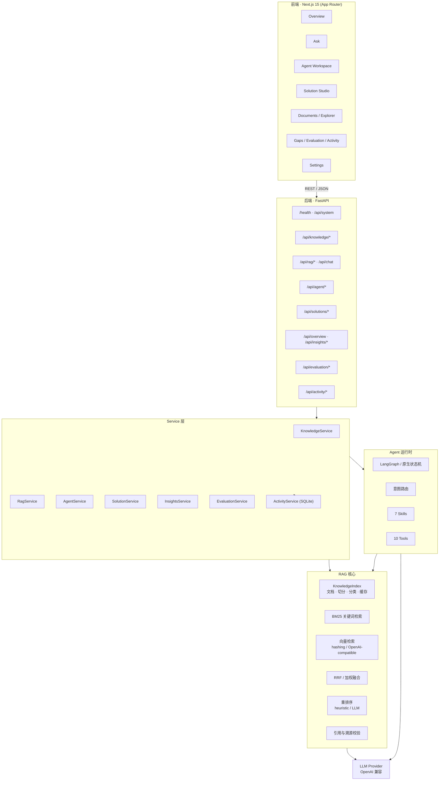

**分层原则**：路由不写业务逻辑，服务层不写 HTTP 细节，RAG 核心不认识 FastAPI，Agent 不认识数据库。
唯一的共享状态是 `KnowledgeIndex`（进程内单例，带磁盘缓存与过期检测）。

---

## 5. RAG 检索链路

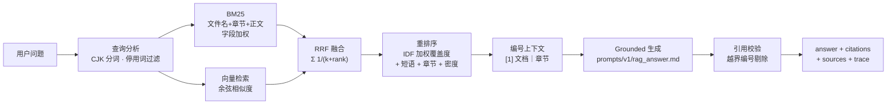

### 这一层踩过的三个真实坑

**① CJK 单字噪声淹没了判别词。**
查询「Rerank 在 RAG 里解决什么问题？」中，`在/里/解/什/么` 等虚词单字进入了 BM25 打分，`RAG.md` 因为重复出现「问题」拿到 21.95 分，而真正定义 Rerank 的文档只有 15.17 分，**根本没进候选集**。
→ 改为 **CJK 字符二元组 + 停用词表**（单字不再参与打分）。修复后三种检索器都把正确文档排到第 1。

**② 文件名完全没有进入索引。**
`召回、Top K、Rerank 与 RAG 检索链路.md` 这个**文件名本身就是完美匹配**的文档，因为 BM25 只索引正文，拿到零权重。
→ 引入 `searchable_text()`：把 **文件名 + 章节路径 + 正文** 一起索引（即真实搜索引擎里的 title boost）。

**③ 重排序把「顺带提到」排在了「真正定义」前面。**
覆盖度按词计数，于是 `rag / 解决 / 问题`（全语料高频）与 `rerank`（稀有判别词）权重相同。
→ 覆盖度改为 **IDF 加权**：最没有信息量的查询词权重降到 0，最稀有的升到 1。

> 这三个问题都不是调 Prompt 能解决的，必须回到检索层。修复前后的对照诊断与结论保留在 [`docs/ARCHITECTURE.md`](docs/ARCHITECTURE.md)。

---

## 6. Agent 架构

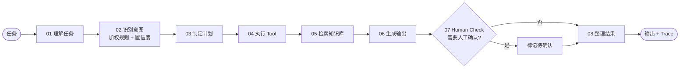

### 为什么「执行 Tool」排在「检索」之前

方案生成 Skill 需要先**解析客户需求**，再从解析结果里提取检索查询词（`search_query`）。
如果先检索再解析，就只能拿原始口语化需求去搜，召回质量明显更差。
这是一处刻意的顺序偏离，代码注释里写明了原因。

### Skill 与 Tool 的职责边界

| | Tool | Skill |
| --- | --- | --- |
| 粒度 | 单个函数 | 一类业务能力 |
| 例子 | `retrieve` / `analyze_coverage` / `summarize_document` | 知识库问答 / 缺口分析 / 售前方案生成 |
| 职责 | 执行动作，返回结构化结果 | 决定调哪些 Tool、检索什么、如何组织输出 |
| 数量 | 10 | 7 |

七个 Skill：`rag_qa` · `knowledge_overview` · `gap_analysis` · `requirement_analysis` · `solution_generation` · `document_intelligence` · `agent_optimization`。

### 双引擎设计

`AGENT_ENGINE` 可取 `auto | langgraph | native`：

- **LangGraph**：真实的 `StateGraph`，节点 + 边 + 编译执行。
- **native**：约 40 行的内置状态机，**共用完全相同的节点函数**。

两者行为一致，只有调度方式不同。这样做的理由是：**一个可选依赖不应该让整个产品跑不起来**。
运行期若 LangGraph 抛错，会自动回退到 native 并在响应中带上警告，绝不静默降级。

---

## 7. 功能矩阵（真实状态）

| 模块 | 能力 | 状态 |
| --- | --- | --- |
| **Overview** | 知识/Agent/RAG/系统四组真实指标、覆盖摘要、最近活动、快捷入口 | ✅ DONE |
| **Ask** | 多轮问答、引用角标可点击、来源抽屉（含全部检索分数）、检索参数可调 | ✅ DONE |
| **Agent Workspace** | 意图与置信度、Skill/Tool 目录、执行计划、Tool 调用表、Trace 时间线、引擎切换 | ✅ DONE |
| **Solution Studio** | 需求表单 + 自然语言、需求解析、8 章节方案、Markdown / Word 导出 | ✅ DONE |
| **Documents** | 拖拽上传、解析/切分/索引、状态与分类、删除、重建索引 | ✅ DONE |
| **Knowledge Explorer** | 文档列表 → 正文/大纲 → 知识块 → 检索探测（BM25/向量/融合/重排分数） | ✅ DONE |
| **Knowledge Gaps** | 11 类资料覆盖判定（covered / partial / missing）+ 证据文档 + 补录建议 | ✅ DONE |
| **Evaluation** | 数据集管理、Hit@K / MRR / Recall、人工评分、历史记录 | ✅ DONE |
| **Activity** | 全量运行台账、类型/状态筛选、成功率、P95 延迟 | ✅ DONE |
| **Settings** | 系统自检、Provider 状态（密钥打码）、检索参数、Prompt 清单与版本 | ✅ DONE |
| **检索** | BM25 + 向量 + RRF/加权融合 + 重排序，Retriever 接口抽象 | ✅ DONE |
| **向量检索** | 离线哈希 TF-IDF（默认）/ 任意 OpenAI 兼容 embeddings | ✅ DONE |
| **文档解析** | Markdown / 文本 / PDF（pypdf）/ Word（python-docx） | ✅ DONE |
| **引用溯源** | 编号上下文 → 角标 → 抽屉 → 原文 + 分数；越界编号自动剔除 | ✅ DONE |
| **Prompt 版本化** | `prompts/v1/*.md` 运行时加载，Settings 页可见占位符 | ✅ DONE |
| **安全** | 演示密码（HMAC 令牌）、只读模式、文件名安全化、路径穿越防护、密钥打码 | ✅ DONE |
| **访问控制** | `DEMO_PASSWORD` 由中间件统一拦截**全部 `/api` 读取与写入**，仅 `/health`、`/api/auth/*` 公开 | ✅ DONE |
| **响应式** | 1440 / 1280 / 1080 三档零横向溢出；明暗双主题各页零 console 错误 | ✅ DONE |
| **移动端** | 390px 下部分页面存在横向溢出（判据见验收报告） | ⚠️ PARTIAL |
| **Docker** | backend + web + 可选 pgvector / legacy profile | ✅ DONE |
| **测试** | 161 个 pytest 用例 + tsc 0 错误 + ESLint 0 警告 + 生产构建通过 | ✅ DONE |
| **pgvector** | `PgVectorStore` 已实现（raw SQL + HNSW），**本机无 PostgreSQL，未做集成验证** | ⚠️ PARTIAL |
| **LLM 重排序** | `RERANK_PROVIDER=llm` 已实现并有启发式兜底，默认关闭以控制成本 | ⚠️ PARTIAL |
| **对话记忆** | 历史仅用于消解指代，尚未做查询改写与长期记忆 | ⚠️ PARTIAL |
| **OCR** | 扫描件 PDF 会明确报「解析失败」，不做假成功 | ❌ TODO |
| **认证** | 仅演示级共享密码，无用户体系与权限模型 | ❌ TODO |

---

## 8. 技术栈

| 层 | 选型 | 说明 |
| --- | --- | --- |
| 前端 | Next.js 15.5 · React 19 · TypeScript 5 · Tailwind CSS 4 | App Router；Design Token 驱动的明暗双主题 |
| 动效 | Framer Motion | 全部控制在 150–350ms，无炫技动画 |
| 图标 | Lucide | |
| 后端 | FastAPI 0.136 · Pydantic 2.13 · Uvicorn | 分层路由/服务/Schema，结构化错误 |
| Agent | LangGraph 1.2 + 内置状态机 | 双引擎、同节点 |
| 检索 | 自研 BM25 · NumPy 向量索引 · RRF 融合 · IDF 加权重排 | 无重量级依赖，全部可解释 |
| 文档解析 | pypdf · python-docx | |
| 存储 | SQLite（活动台账）· NPZ（索引缓存）· JSON（评测集） | 零外部依赖即可运行 |
| 测试 | pytest 9 · httpx · FastAPI TestClient | 161 用例，全程不联网 |
| 部署 | Docker Compose | backend / web / 可选 pgvector / 可选 legacy |

---

## 9. 快速开始

### 方式一：本地开发（推荐）

```bash
git clone https://github.com/Evolve-Gem/enterprise-rag-assistant.git
cd enterprise-rag-assistant

# 1) 配置环境变量（只有 LLM key 是必填）
cp .env.example .env
#    编辑 .env，填入 LLM_API_KEY（或 DEEPSEEK_API_KEY）

# 2) 后端
python -m venv .venv
.venv/Scripts/activate            # macOS/Linux: source .venv/bin/activate
pip install -r backend/requirements.txt
cd backend && uvicorn app.main:app --reload --port 8000
#    接口文档：http://localhost:8000/docs

# 3) 前端（新开一个终端，回到仓库根目录）
cd apps/web
npm install
npm run dev                        # http://localhost:3001
```

> 没有 LLM key 也能启动：问答会返回检索到的证据并说明模型未配置，其余功能（检索、探索、缺口分析、评测）全部可用。

### 方式二：Docker Compose

```bash
cp .env.example .env               # 填入 LLM_API_KEY
docker compose up --build
# 前端 http://localhost:3001 · 后端 http://localhost:8000/docs

docker compose --profile pg up     # 额外启动 PostgreSQL + pgvector
docker compose --profile legacy up # 额外启动 V2 Streamlit 演示（:8502）
```

### 方式三：运行测试

```bash
cd backend
../.venv/Scripts/python -m pytest -q      # 161 passed

cd ../apps/web
npm run typecheck                          # tsc 0 错误
npm run lint                               # ESLint 0 警告
npm run build                              # 生产构建
```

---

## 10. 环境变量

完整清单见 [`.env.example`](.env.example)。最关键的几项：

| 变量 | 默认 | 说明 |
| --- | --- | --- |
| `LLM_API_KEY` / `DEEPSEEK_API_KEY` | — | **必填**；任意 OpenAI 兼容服务 |
| `LLM_BASE_URL` / `LLM_MODEL` | `https://api.deepseek.com` / `deepseek-v4-flash` | 供应商无关 |
| `EMBEDDING_PROVIDER` | `hashing` | `hashing` 离线可用；`openai` 接任意 embeddings；`none` 纯关键词 |
| `RETRIEVER_MODE` | `hybrid` | `keyword` / `vector` / `hybrid` |
| `FUSION_STRATEGY` | `rrf` | `rrf` 无需跨分支标定；`weighted` 需调 `FUSION_ALPHA` |
| `RERANK_PROVIDER` | `heuristic` | `off` / `heuristic` / `llm` |
| `AGENT_ENGINE` | `auto` | `auto` / `langgraph` / `native` |
| `VECTOR_STORE` | `numpy` | `numpy` / `pgvector`（需 `DATABASE_URL`） |
| `DEMO_PASSWORD` | 空 | 设置后启用访问密码 |
| `DEMO_READ_ONLY` | `false` | `true` 关闭全部写操作 |
| `PROMPT_VERSION` | `v1` | 对应 `prompts/<version>/` |

**安全约定**：后端响应中的密钥一律打码（`****1234`）；活动台账按字段名正则过滤凭据类键；前端从不存储密钥。

---

## 11. 演示场景

完整脚本见 [`docs/DEMO_SCRIPT.md`](docs/DEMO_SCRIPT.md)。五个稳定场景：

1. **知识库问答** —— 提问并展示答案中的引用角标，点击 `[2]` 打开来源抽屉，看到原文、章节与四类检索分数。
2. **引用下钻** —— 在抽屉里对比同一问题的 `BM25 分 / 向量相似度 / RRF 融合分 / 重排分`，解释为什么这个片段排在前面。
3. **客户需求 → 方案** —— 在 Solution Studio 填入「某职业院校知识库」需求，得到需求画像 + 8 章节方案，导出 Word。
4. **Agent 任务执行** —— 让 Agent 分析「知识库还缺哪些售前资料」，展开 Trace 看 8 个节点的耗时与 Tool 调用。
5. **知识缺口分析** —— 在 Gaps 页看到 covered / partial / missing 三类判定及其证据文档与补录建议。

---

## 12. 评测

### 检索指标（确定性计算，可复现）

在 10 条冻结评测集上、针对当前 24 篇知识库、`k=4`、`mode=hybrid`、`rerank=heuristic`
（**验收实测 2026-09-17**，复现方式：`POST /api/evaluation/run {"k":4}`）：

| 指标 | 数值 | 含义 |
| --- | --- | --- |
| **Hit@4** | **90.0%** | 期望文档进入 Top-4 的比例（10 条中 9 条命中） |
| **MRR** | **0.800** | 首个命中的名次倒数均值 |
| **Recall@4** | **69.2%** | 期望文档被召回的比例 |
| **关键词覆盖** | 45.6% | 召回片段覆盖问题关键词的比例 |
| **平均检索延迟** | 约 2 ms | 不含 LLM 生成 |

> 评测集中仍有一条 MISS：「知识库里有哪些文档？」—— 这是一条**概览类**问题，本身没有「期望文档」。
> 种子数据已把它换成真正的检索问题，但**已冻结的评测集不会自动重写**，所以本轮结果仍受它影响。
> 这是评测集设计问题，不是检索退化；把它算进去反而更诚实。

### 答案质量

**只使用人工评分**（`correct` / `partial` / `wrong`），未评分时 `answer_accuracy = null`。
本项目**不使用 LLM 自评分数** —— 那只是把幻觉换了一个地方存放。

---

## 13. 项目结构

```text
enterprise-rag-assistant/
├── apps/web/                     # Next.js 15 前端
│   └── src/
│       ├── app/                  # 10 个页面（App Router）
│       ├── components/           # layout / ui / rag / agent / mascot / providers
│       └── lib/                  # api 客户端 · types（镜像 Pydantic）· hooks · utils
├── backend/
│   ├── app/
│   │   ├── main.py               # 应用工厂、CORS、异常处理、启动预热
│   │   ├── core/                 # 配置 · 日志 · 错误 · 安全 · 追踪
│   │   ├── api/routes/           # 9 个路由模块
│   │   ├── schemas/              # Pydantic 契约
│   │   ├── services/             # 8 个服务（知识/RAG/Agent/方案/洞察/评测/台账/设置）
│   │   ├── rag/                  # 索引 · 切分 · BM25 · 向量 · 检索 · 重排 · 引用 · Prompt
│   │   └── agents/               # state · router · graph · skills · tools
│   ├── tests/                    # 161 个 pytest 用例
│   └── data/                     # 运行时数据（索引缓存 / 台账 / 评测集，已 gitignore）
├── knowledge_base/               # 知识资产（24 篇，可自由替换）
├── prompts/v1/                   # 版本化 Prompt 模板（运行时加载）
├── legacy/                       # 冻结的 V2 Streamlit 演示
├── docker/                       # Dockerfile.backend · Dockerfile.web
├── docker-compose.yml
└── docs/                         # ARCHITECTURE · INTERVIEW_GUIDE · DEMO_SCRIPT · V3_ACCEPTANCE_REPORT
```

---

## 14. Roadmap

**已完成（V3.0）**：前后端分离 · 混合检索 · 重排序 · 引用溯源 · Agent/Skill/Tool 三层 · 双引擎 · Trace · 方案生成 · 缺口分析 · 评测中心 · 活动台账 · Prompt 版本化 · Docker · 161 个测试 · 本地验收（49/49 安全项、40 次真实页面渲染）。

**下一步**：

1. **多轮对话的查询改写** —— 当前历史只用于消解指代，应改为先用小模型改写查询再检索。
2. **pgvector 生产验证** —— 代码已实现，需要在真实 PostgreSQL 上跑集成测试并补测 HNSW 参数。
3. **评测闭环** —— 把失败案例自动转化为 Prompt / 切分参数的调优建议，形成「评测驱动迭代」。
4. **用户体系与权限** —— 目前只有演示级共享密码；企业场景需要按部门/密级过滤检索结果。
5. **OCR 兜底** —— 扫描件 PDF 目前明确报失败，接入 OCR 后可扩大可索引范围。
6. **流式输出** —— SSE 逐字返回，配合现有的 Mascot 生成态动画。

---

## 15. 许可与说明

- 知识库内容为个人学习笔记与模拟企业资料，**不含任何真实客户数据或商业机密**。
- 项目中的检索指标、延迟、token 消耗均为本机实测值，未做美化。
- 未实现的能力在功能矩阵中标注为 ⚠️ / ❌，不做「看起来完成了」的占位。
